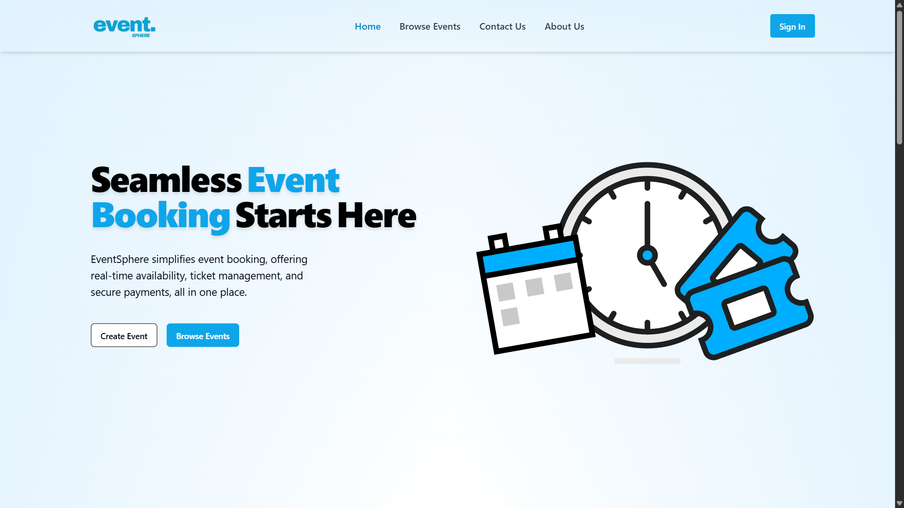
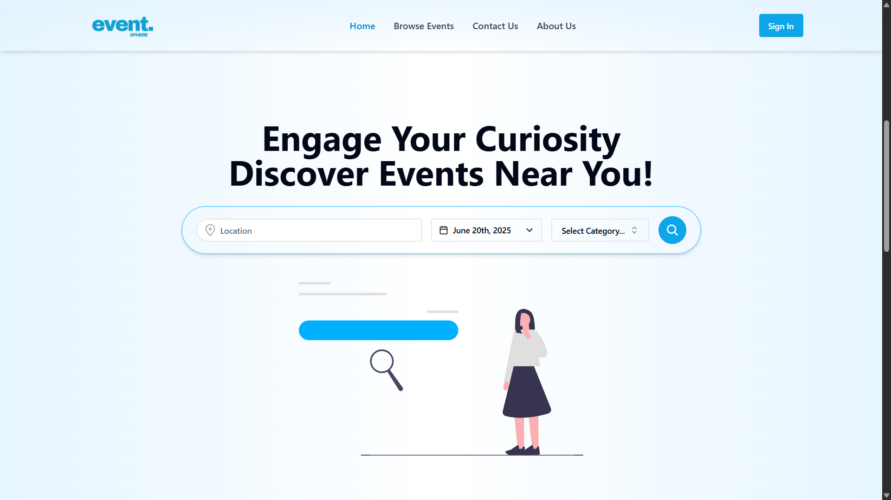
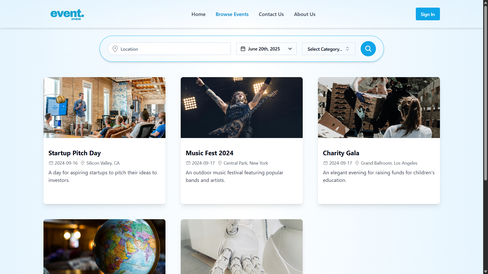
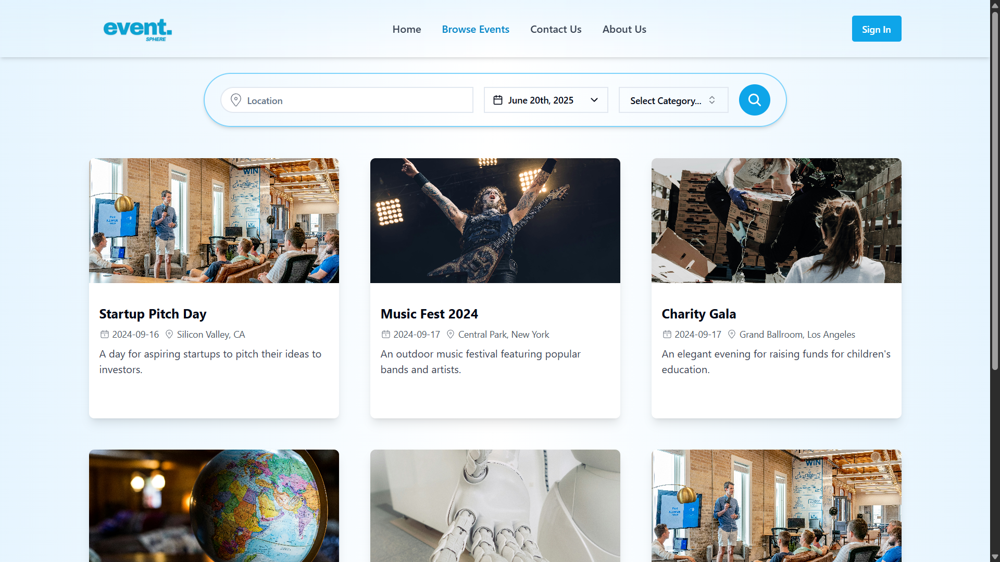

<div align="center">

# 🎟️ EventSphere

**Seamless Event Management & Ticket Booking Platform**

[](https://opensource.org/licenses/MIT)
[](https://nodejs.org/)
[](https://www.mongodb.com/)
[](https://reactjs.org/)

_Simplifying event discovery, booking, and management for users, organizers, and admins_

**Created by [Prajeesh Chavan](https://github.com/prajeesh-chavan)**

</div>

---

## 🎥 Preview

<div align="center">
<!-- Add screenshots here -->




</div>

---

## ⭐ Why EventSphere?

<table>
<tr>
<td>

**🎫 Hassle-Free Booking**

- Browse & search events
- Secure ticket purchase
- Instant booking history

</td>
<td>

**🛠️ Organizer Tools**

- Create & manage events
- Track bookings
- Upload event images

</td>
<td>

**📊 Admin Analytics**

- Manage users & events
- Platform analytics
- Role-based dashboards

</td>
</tr>
</table>

---

## ✨ Features

- **User Authentication** – Secure registration and login with JWT
- **Event Discovery** – Browse, search, and view event details
- **Ticket Booking** – Book, view, and cancel tickets
- **Organizer Dashboard** – Create, edit, and manage events
- **Admin Panel** – Manage all users and events, view analytics
- **Profile Management** – Update personal info and profile picture
- **Responsive UI** – Built with React, Vite, and Tailwind CSS

---

## 🚀 Quick Start

```bash
# 1. Clone the repository
git clone https://github.com/prajeesh-chavan/event-sphere.git
cd event-sphere

# 2. Backend setup
cd backend
npm install
cp .env.example .env   # Add your MongoDB URI, JWT secret, etc.
npm run dev

# 3. Frontend setup
cd ../frontend
npm install
npm run dev

# Visit: http://localhost:5173
```

---

## 🔧 Installation

### System Requirements

| Component   | Minimum | Recommended |
| ----------- | ------- | ----------- |
| **Node.js** | 16.x    | 18.x LTS    |
| **MongoDB** | 4.4+    | 6.0+        |

### Environment Variables

**Backend (.env):**
```env
MONGODB_URI=mongodb://localhost:27017/eventsphere
JWT_SECRET=your-secret
PORT=5000
EMAIL=your-email@example.com
EMAIL_PASSWORD=your-email-password
```

**Frontend (.env):**
```env
VITE_API_URL=http://localhost:5000
```

---

## 🏗️ Architecture

```
event-sphere/
├── backend/
│   ├── controllers/
│   ├── models/
│   ├── routes/
│   ├── config/
│   └── middlewares/
├── frontend/
│   ├── src/Components/
│   ├── src/Pages/
│   ├── src/services/
│   └── public/
└── README.md
```

### 🛠️ Tech Stack

|        Backend         |       Frontend          |
| :-------------------: | :---------------------: |
| Node.js, Express      | React, Vite            |
| MongoDB, Mongoose     | Tailwind CSS           |
| JWT, Multer, Nodemailer| React Router, Axios    |

---

## 📖 Usage

- **Users:** Register, browse events, book/cancel tickets, manage profile.
- **Organizers:** Register, create/edit events, manage bookings.
- **Admins:** Manage events and users, access analytics dashboard.

---

## 🤝 Contributing

We welcome all contributions!

1. **Fork** the repository
2. **Create** your feature branch (`git checkout -b feature/my-feature`)
3. **Commit** your changes (`git commit -am 'Add feature'`)
4. **Push** to the branch (`git push origin feature/my-feature`)
5. **Open** a Pull Request

---

## 🆘 Support

- **Docs:** [In progress]
- **Issues / Bugs:** [GitHub Issues](https://github.com/prajeesh-chavan/event-sphere/issues)
- **Contact:** [prajeeshchavan@gmail.com](mailto:prajeeshchavan@gmail.com)

---

<div align="center">

_Made with ❤️ by Prajeesh Chavan_

</div>
